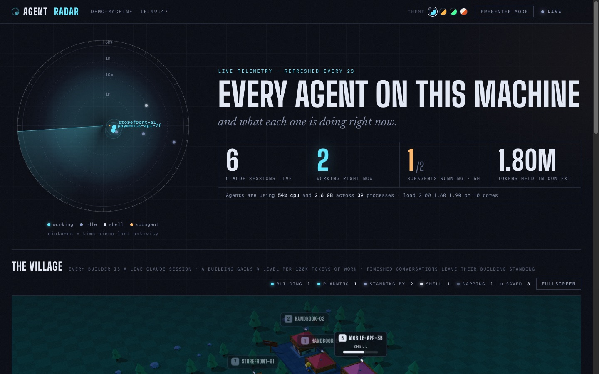
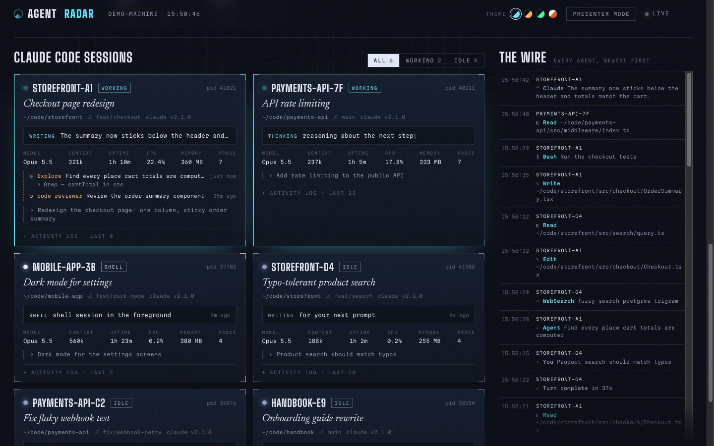
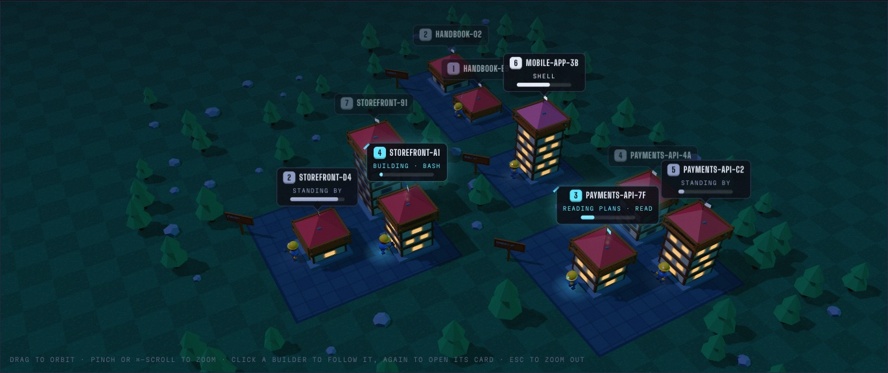

# Agent Radar

**A live, local dashboard of the AI agents running on your computer.**

Every Claude Code session you have open shows up as a blip on a radar, a card with
what it is doing right now, and a little builder in a 3D village whose building rises
as the agent works. Codex, Cursor, Claude Desktop and other agent apps are picked up
too. Everything runs on your machine; nothing is sent anywhere.



- **One command, no install:** `npx github:syamsundar662/agent-radar --open`
- **No dependencies:** plain Node.js 18+, no build step
- **Read-only:** it only reads the files Claude Code already writes
- **Private:** the server only listens on `127.0.0.1`

---

## Contents

- [Quick start](#quick-start)
- [Options](#options)
- [What you'll see](#what-youll-see)
- [The village](#the-village)
- [Platform support](#platform-support)
- [Privacy and security](#privacy-and-security)
- [Troubleshooting](#troubleshooting)
- [How it works](#how-it-works)
- [Development](#development)
- [License](#license)

## Quick start

You need [Node.js](https://nodejs.org) 18 or newer and `git`. To see live data you also
need [Claude Code](https://docs.anthropic.com/en/docs/claude-code) running in at least
one terminal.

**Run it straight from GitHub** (nothing to install):

```sh
npx github:syamsundar662/agent-radar --open
```

The dashboard opens at <http://localhost:4747>. Leave the command running and open
Claude Code in other terminals; each session appears within two seconds.

**Just want to look around?** Demo mode shows made-up sessions, no Claude Code needed:

```sh
npx github:syamsundar662/agent-radar --demo --open
```

**Install it as a command:**

```sh
npm install -g github:syamsundar662/agent-radar
agent-radar --open
```

**Or clone it:**

```sh
git clone https://github.com/syamsundar662/agent-radar.git
cd agent-radar
npm start            # or: npm run demo
```

Stop it with `Ctrl+C`.

## Options

```text
agent-radar [options]

  -p, --port <n>   port to listen on (default 4747, or $PORT)
  -o, --open       open the dashboard in your browser
      --demo       show made-up sessions, no Claude Code needed
  -h, --help       show this help
  -v, --version    print the version
```

| Environment variable | Default | What it does |
| --- | --- | --- |
| `PORT` | `4747` | Same as `--port`. |
| `CLAUDE_CONFIG_DIR` | `~/.claude` | Where Claude Code keeps its data. Set this if you moved it. |
| `AGENT_RADAR_DATA` | `~/.agent-radar` | Where the village's saved buildings are stored. |

## What you'll see

### Radar scope

Every Claude Code session is a blip. Working sessions sit at the centre; idle ones
drift outward by how long ago they last did anything (rings at 1 minute, 10 minutes,
1 hour and 6 hours). Sessions in the same project share a bearing, and running
subagents orbit their parent. Hover a blip for details, click it to jump to its card.

### Session cards



One card per session:

- status (working, idle or shell) and the session's AI-generated title
- project folder, git branch and Claude Code version
- what it is doing **right now**: the current tool call, thinking, or writing a reply
- model, context size, uptime, and CPU and memory of the whole process tree
- subagents from the last 6 hours (running, done or stalled)
- the last prompt you sent, and an expandable activity log

Filter the deck with **All / Working / Idle**.

### The wire

A merged, newest-first feed of prompts, tool calls, replies and errors across every
session and subagent. Click an entry to jump to its session.

### Also on this machine

Other AI agents found in the process list: Claude Desktop, Codex, Cursor, ChatGPT,
Windsurf, Gemini CLI, Aider, Ollama, GitHub Copilot and headless `claude -p` runs,
with their CPU and memory.

### Presenter mode and themes

**Presenter mode** blurs prompts and tool details so you can share your screen.
Pick a theme from the swatches in the header: Midnight, Control room, Phosphor or
Daylight. Both choices are remembered in your browser.

## The village



A Clash-of-Clans-style 3D village where every Claude Code conversation is a builder,
and its building **rises as the agent actually works**.

- **Levels:** one level per 100k tokens the conversation holds in context, up to 8
  levels. The bricks of the level under construction fill in live as the number grows.
  Finishing a level pops the roof up with a star burst and a "Level up!" banner.
- **Districts:** each project folder is a paved district with its own roof colour and
  a signpost showing how many builders and saved buildings it has.
- **Builders act out what their session is doing:**

  | The session is... | The builder... |
  | --- | --- |
  | running tools | hammers at the wall (chimney smokes) |
  | reading files or searching | studies the blueprints |
  | thinking | looks up at the building, thought bubble spinning |
  | running subagents | points; each running subagent is a teal-hatted apprentice |
  | hitting a tool error | facepalms |
  | waiting for your prompt | stands by |
  | idle for 10+ minutes | naps on a crate |
  | in a shell | taps a foot |

- **Saved buildings:** when a session closes, or `/clear` starts a new conversation,
  the builder packs up and the building stays standing at the level it reached, with
  its lights off. Each new conversation builds on the next plot, and a resumed
  conversation gets its builder back. Hover a saved building to see its title, project
  and when it closed. Conversations that never did any work aren't kept.
- **Moving around:** drag to orbit, pinch or `Cmd`/`Ctrl` + scroll to zoom. Click a
  builder to follow it (buildings in the way are cut away), click it again to open its
  card, press `Esc` to zoom back out. **Fullscreen** fills the screen with the village.

Saved buildings are stored in `~/.agent-radar/village.json`, which Agent Radar keeps up
to date every 15 seconds even when no browser tab is open. To remove a building, stop
Agent Radar, delete the building's entry from that file (or delete the whole file to
start a fresh village), then start it again.

The village needs WebGL. If your browser doesn't have it, the rest of the dashboard
still works.

## Platform support

| Platform | Status |
| --- | --- |
| macOS | Supported, tested |
| Linux | Supported, tested |
| Windows (WSL) | Should work like Linux, untested: run Agent Radar inside WSL, next to Claude Code |
| Windows (native) | Experimental and untested: processes are listed with PowerShell, and CPU % always shows 0 |

Tested with Claude Code 2.1. Agent Radar reads Claude Code's local files, whose format
isn't a public API, so a future Claude Code release could change what it can show. If
something stops working after an update, please
[open an issue](https://github.com/syamsundar662/agent-radar/issues).

## Privacy and security

Your transcripts contain your prompts, file paths and tool output, so Agent Radar is
built to keep them on your machine:

- The server listens on `127.0.0.1` only, so other computers on your network can't
  reach it.
- Requests whose `Host` header isn't `localhost`, `127.0.0.1` or `[::1]` are refused,
  so a malicious website can't read the dashboard through DNS rebinding.
- Claude Code's files are only ever read, never changed. The only file Agent Radar
  writes is `~/.agent-radar/village.json`.
- Obvious secrets (passwords in URLs, `sk-...`, `ghp_...`, `AKIA...` and Slack keys,
  `token=...`, `password=...`) are masked before they reach the page. This is a safety
  net, not a guarantee: use **Presenter mode** before sharing your screen.
- There is no telemetry. The only outside request is the page loading its fonts from
  Google Fonts; without internet access it falls back to system fonts.

## Troubleshooting

**No sessions show up.**
Check that Claude Code is running in a terminal, then look for its session files:

```sh
ls ~/.claude/sessions
```

If that folder is empty or missing, start `claude` and try again. If you moved Claude
Code's data, set `CLAUDE_CONFIG_DIR` to the new folder. Sessions started by other
users on the same machine aren't visible.

**"Port 4747 is busy".**
Agent Radar is probably already running; open <http://localhost:4747>. Otherwise pick
another port with `--port 4848`.

**The village is blank or says it needs WebGL.**
Turn on hardware acceleration in your browser settings, or try another browser. The
rest of the dashboard works without it.

**CPU and memory show 0.**
Agent Radar couldn't read the process list (it prints a warning in the terminal when
that happens). On native Windows, CPU % is always 0.

**A session's card says "Untitled session".**
Claude Code writes a title once the conversation gets going, so brand new sessions
don't have one yet.

**I want to reset the village.**
Stop Agent Radar, delete `~/.agent-radar/village.json`, and start it again.

## How it works

Every 2 seconds, while a dashboard tab is open, the server lists processes, reads
Claude Code's session files and the end of each transcript, and streams a snapshot to
the page over Server-Sent Events. The page draws the radar, cards, wire and village
from that snapshot.

| Source | Used for |
| --- | --- |
| `~/.claude/sessions/<pid>.json` | live sessions: name, status, folder, version |
| `~/.claude/projects/<folder>/<session>.jsonl` (end of file only) | title, model, context size, activity |
| `.../<session>/subagents/*.jsonl` and `*.meta.json` | subagent type, task, state |
| process list (`ps`, or PowerShell on Windows) | liveness, CPU, memory, uptime, other agent apps |

See [docs/how-it-works.md](docs/how-it-works.md) for the full design: the snapshot
format, how statuses and levels are worked out, and how saved buildings are tracked.

## Development

There is no build step and no dependencies; edit a file and reload the page.

```text
server.mjs      HTTP server, command-line options, Server-Sent Events stream
collector.mjs   builds a snapshot: sessions, transcripts, subagents, processes
village.mjs     records conversations and keeps their buildings after they end
demo.mjs        made-up sessions for --demo
public/
  index.html    page layout
  app.js        radar, session cards, the wire, themes, presenter mode
  floor.js      the 3D village (three.js)
  styles.css    styles; every colour lives in the theme blocks at the top
  vendor/       three.js r170 (MIT)
docs/           screenshots and the design notes
```

- **Run against fake data** while you work on the UI: `npm run demo`.
- **Add a theme:** copy one of the theme blocks at the top of `public/styles.css`, change
  the colours, and add a swatch button in `public/index.html` plus its id to
  `THEME_IDS` in `public/app.js`. The radar and the village read the same CSS
  variables, so they follow automatically.
- **Detect another agent app:** add an entry to `OTHER_AGENTS` in `collector.mjs`, either
  by executable name (`bin`) or by a pattern for the full command line (`app`).

Bug reports and pull requests are welcome. Please keep it dependency-free and
local-only.

## License

[MIT](LICENSE) © 2026 Syam Sundar. Bundles [three.js](https://threejs.org) (MIT).

Agent Radar is an independent project and isn't affiliated with or endorsed by
Anthropic.
